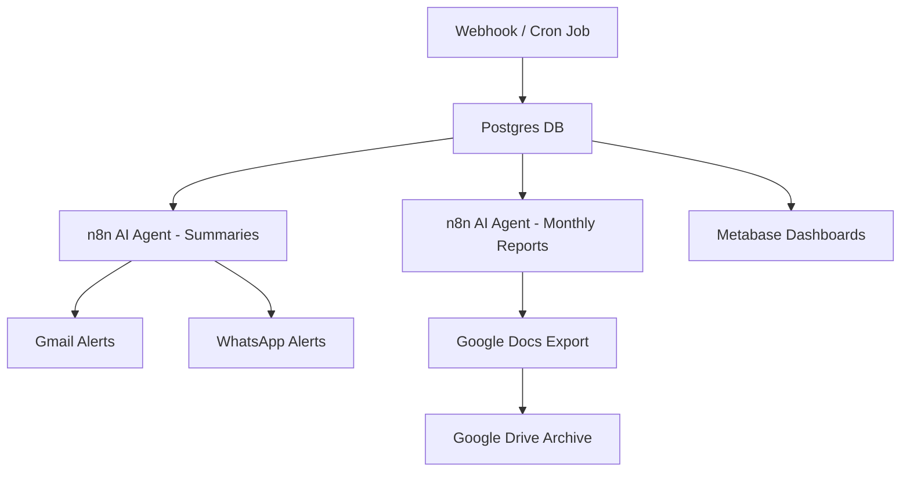

# 🔒 N8N & Metabase Automation for AMPDefend

This repository contains an **end-to-end cybersecurity automation platform** using:

* **[n8n](https://n8n.io)** → for alert ingestion, AI summarization, notifications, and monthly reporting.
* **[Metabase](https://www.metabase.com/)** → for real-time dashboards and SOC analytics on stored logs.

Together, they provide **automated alert management + live dashboards** to strengthen AMPDefend’s cybersecurity operations.

---

## 📌 Features

### 🚨 n8n (Automation Layer)

* Collects logs from Raspberry Pi devices via **Webhook**.
* Stores alerts in **Postgres**.
* Summarizes logs into **human-readable WhatsApp/email alerts**.
* Generates **monthly AI reports** → exported to **Google Docs + Drive**.

### 📊 Metabase (Analytics Layer)

* Connects directly to the **same Postgres DB**.
* Provides dashboards for:

  * Threat detection timeline (hourly/daily).
  * Threat type distribution by severity.
  * Geo heatmap of alerts by region/country.
 
---

## ⚙️ Architecture



---

## 🚀 Getting Started

### 1. Requirements

* **Docker & docker-compose**
* API credentials: Gmail, WhatsApp Business (Meta), Google Docs, Google Drive
* AI key (Groq)

### 2. Install & Run

```bash
# Clone repository
git clone https://github.com/<your-org>/N8N-automation-for-AMPDefend.git
cd N8N-automation-for-AMPDefend

# Build and start all services
docker compose build
docker compose up -d
```

This will launch:

* **n8n** (workflow automation engine)
* **Postgres** (alert storage + analytics source)
* **Metabase** (dashboards)
*  **pgadmin** 

---

## ⚙️ Metabase Setup

Once containers are running:

1. Import predefined **Metabase dashboards** from `metabase_queries.txt`.

2. Example Dashboards:

   * 📆 **Threat detection timeline** (hourly/daily)
   * ⚠️ **Threat type distribution by severity**
   * 🌍 **Geo heatmap** (alert sources)
  
---

## 📂 Repository Structure

```
├── workflow.json              # n8n workflow export
├── docker-compose.yml          # Orchestration (n8n, Postgres, Metabase)
├── README.md                  # Documentation
├── docs/                      # Example reports, screenshots
├── metabase_queries.txt       # SQL queries / sample dashboards
└── .env.example               # Example environment variables
```

---

## 🛡️ Security Benefits

* **Reduced alert fatigue** → AI summaries.
* **Faster response** → WhatsApp & Gmail instant notifications.
* **Better visibility** → Metabase dashboards.
* **Audit-ready** → Monthly AI reports stored in Google Docs & Drive.

---

👉 This way, your repo clearly says:

* It’s **not just n8n**, but **n8n + Metabase**.
* You’ve included **setup instructions** for both.

Do you want me to also prepare a **docker-compose.yml example** that runs **n8n + Postgres + Metabase** together (with named volumes + networks)? That way anyone cloning your repo can spin up the full stack instantly.
